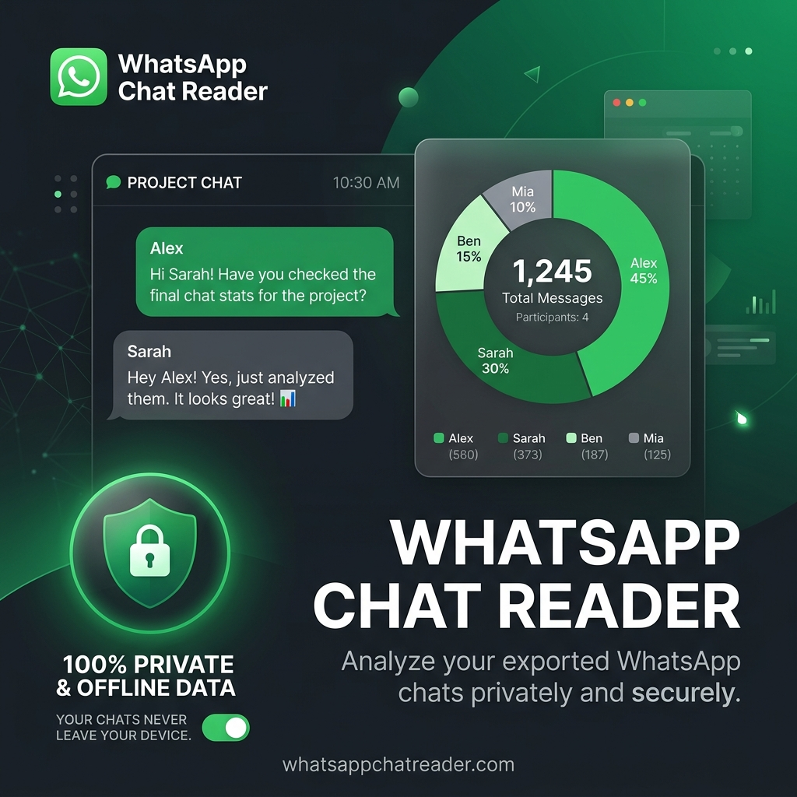

# 💬 WhatsApp Chat Reader

A private, local-first web application to read, search, and analyze your exported WhatsApp chats (`.txt` files) in a clean, WhatsApp-style user interface.



## ✨ Features

- 🔒 **100% Private & Secure**: All chat parsing and storage happens entirely in your browser using IndexedDB. No servers, no network requests, and your data never leaves your device.
- ⚡ **Large Chat Support**: Efficiently handles files with hundreds of thousands of messages using a virtualized message list (`@tanstack/react-virtual`).
- 🔍 **Powerful Search & Navigation**: Search messages, highlight keywords, and instantly jump to any message's date or position.
- ⭐ **Starred Messages**: Star important messages to keep them bookmarked locally.
- 📊 **Participant Stats**: Visual breakdown of participant message counts and activity.
- 🍏🤖 **Cross-Format Support**: Works seamlessly with standard WhatsApp exports from both iOS and Android.

## 🛠️ Tech Stack

- **Framework**: React 19 + TypeScript
- **Bundler**: Vite 6
- **Styling**: Tailwind CSS v4
- **State Management**: Zustand
- **Caching & Querying**: TanStack Query v5 (React Query)
- **Database**: IndexedDB (using `idb` wrapper)
- **Animations**: Motion (Framer Motion)
- **Formatting & Linting**: Biome

## 🚀 Getting Started

### Prerequisites

You need [Bun](https://bun.sh) installed.

### Installation

```bash
bun install
```

### Development

Start the Vite development server:

```bash
bun run dev
```

### Quality Assurance

Run typechecking, linting, and formatting checks:

```bash
bun run typecheck
bun run lint
bun run format
```

### Production Build

Build the application for production:

```bash
bun run build
```
